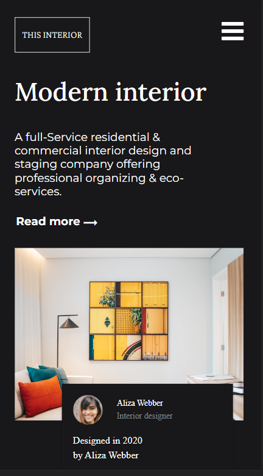

<!-- Please update value in the {}  -->

<h1 align="center">Interior Consultant Page</h1>

   Solution for a challenge from  <a href="http://devchallenges.io" target="_blank">Devchallenges.io</a>.

  <h3>
    <a href="https://maikocode.github.io/Interior-Consultant-Page/">
      Demo
    </a>
     | 
    <a href="https://maikocode.github.io/Interior-Consultant-Page/">
      Solution
    </a>
     | 
    <a href="https://devchallenges.io/challenges/Jymh2b2FyebRTUljkNcb">
      Challenge
    </a>
  </h3>

<!-- TABLE OF CONTENTS -->

## Table of Contents

- [Overview](#overview)
  - [Built With](#built-with)
- [Features](#features)
- [Contact](#contact)

<!-- OVERVIEW -->

## Overview

- Desktop version:

- Mobile version

### Built With

HTML, CSS && a bit of JS

## Features

-Hamburger Menu

## Contact

- GitHub [@MaikoCode](https://github.com/MaikoCode)
- Twitter [@Maikoke5](https://twitter.com/Maikoke5)
